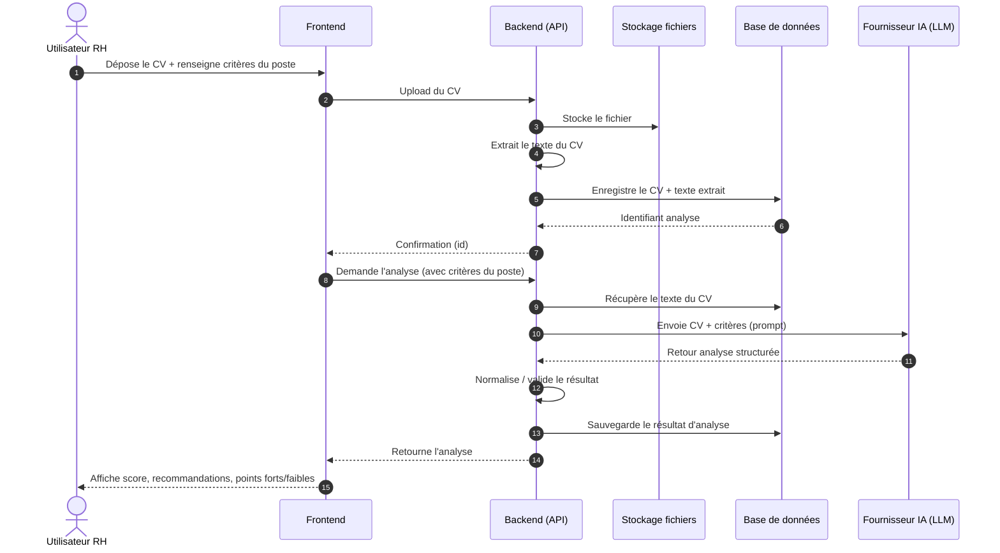
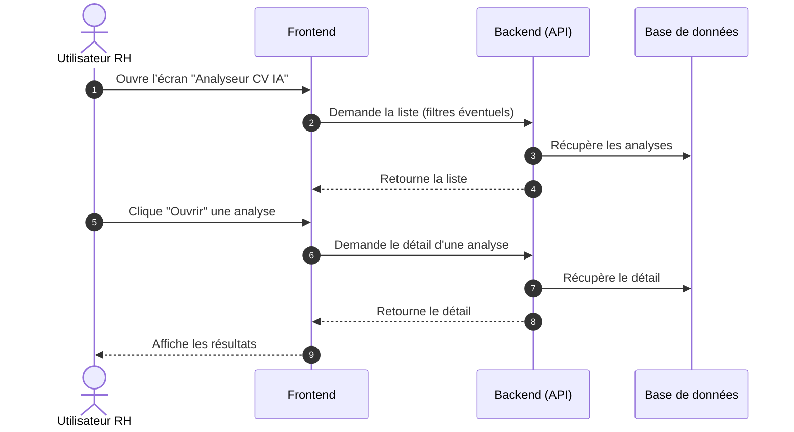
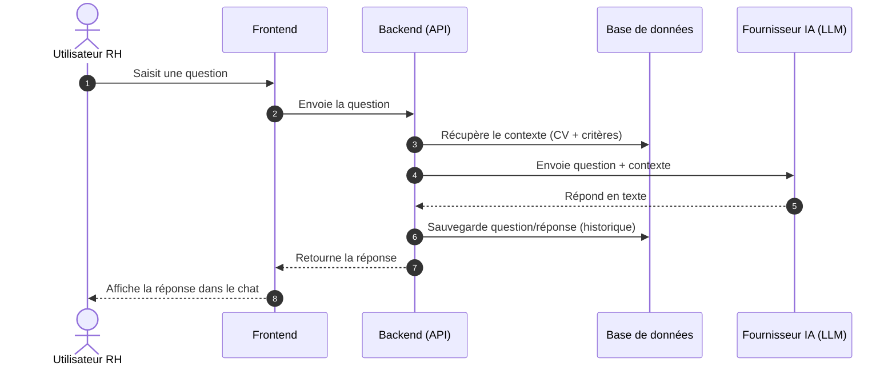
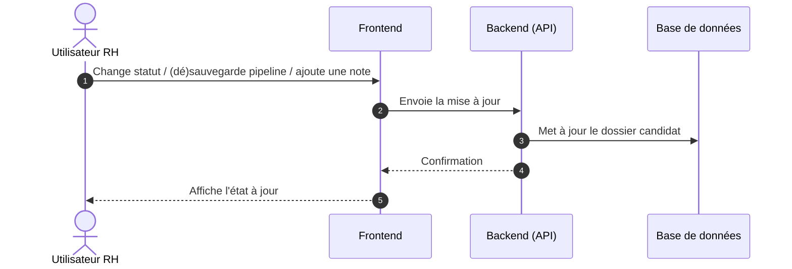
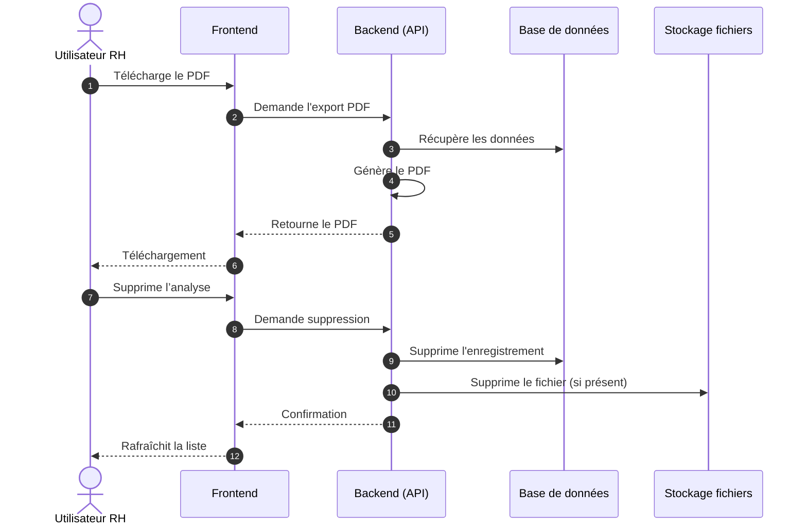

# Diagrammes de séquence — Analyse de CV (Vue générale)

Ces diagrammes sont volontairement **généraux** (sans noms de fichiers) pour montrer le flow fonctionnel : **Frontend → Backend → Stockage/DB → LLM**.

---

## 1) Upload + Analyse d’un CV (flux principal)

---

## 2) Consultation d’une analyse (liste + détail)

---

## 3) Chat IA basé sur un CV

---

## 4) Actions RH (pipeline + notes)

---

## 5) Export PDF + suppression

