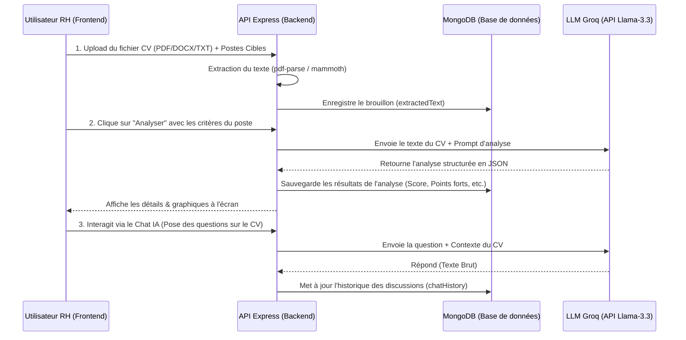

# Guide de Fonctionnement : Analyseur de CV avec Intelligence Artificielle

Ce document explique en détail le fonctionnement technique de l'analyseur de CV IA de votre application de gestion RH (MERN Stack). Il détaille l'architecture générale, le modèle de données, le code backend, l'API, et les pages du frontend.

---

## 1. Architecture Générale et Flux d'Exécution

Le système suit un flux en 4 étapes :

---

## 2. Modèle de Données (Database Schema)
Le modèle est défini dans le fichier :  
**Fichier :** [CvAiAnalysis.model.js](file:///c:/Users/ADMIN/hadil-project/Backend/src/models/CvAiAnalysis.model.js)

### Propriétés clés du schéma Mongoose :
* `candidateName` (Ligne 8) : Nom du candidat détecté automatiquement à partir du texte du CV ou du nom du fichier.
* `extractedText` (Ligne 13) : Le texte intégral extrait du document pour servir de contexte à l'IA.
* `jobCriteria` (Ligne 24-34) : Le poste cible saisi par le RH (Titre, description, compétences requises, expérience, langues).
* `analysisResult` (Ligne 36-54) : L'objet structuré retourné par l'IA contenant :
  * `job_match_score` : Pourcentage d'adéquation (0 à 100).
  * `recommendation` : `strong_match` (Excellente), `possible_match` (Possible), ou `weak_match` (Faible).
  * `detected_skills`, `strongest_points`, `weak_points`, `missing_requirements`.
* `chatHistory` (Ligne 60-70) : Liste des questions posées par le RH et les réponses générées par l'IA.
* `internalNotes` (Ligne 72-82) : Notes internes du recruteur RH sur le candidat.
* `pipelineStatus` (Ligne 84) : Statut de sélection (`pending`, `shortlisted`, `rejected`).
* `savedToPipeline` (Ligne 89) : Booléen (`true`/`false`) indiquant si le candidat est conservé dans le vivier actif du recrutement.

---

## 3. Couche Service Backend (L'Intelligence Artificielle)
**Fichier :** [aiCv.service.js](file:///c:/Users/ADMIN/hadil-project/Backend/src/services/aiCv.service.js)

### A. Extraction de Texte
* **Lignes 118-129 (`extractTextFromFile`)** : Selon le type MIME du fichier (`application/pdf`, `docx`), la fonction utilise :
  * `pdf-parse` pour lire les PDF.
  * `mammoth` pour lire le contenu textuel brut des fichiers Word `.docx`.
  * La conversion standard UTF-8 pour les fichiers texte brut `.txt`.

### B. Connexion à l'API LLM (Groq / Llama)
* **Lignes 157-215 (`callXai`)** : Effectue la requête HTTP POST vers l'API de Groq (`https://api.groq.com/openai/v1/chat/completions`) :
  * **Option JSON dynamique (Ligne 177)** : Si `isJson` est `true`, elle configure `response_format: { type: 'json_object' }`. Ceci force l'IA à répondre avec du JSON valide (ex: pendant l'analyse). Si `isJson` est `false` (ex: pour le chat), ce paramètre n'est pas envoyé, ce qui évite les erreurs d'API Groq.

### C. Analyse Automatique du CV
* **Lignes 217-260 (`analyzeCv`)** : Construit le `userPrompt` en combinant le texte extrait du CV et les critères du poste. Il demande un format JSON strict.
* **Lignes 57-89 (`normalizeAnalysis`)** : Traite les valeurs retournées par l'IA. Si l'IA renvoie un score sous forme décimale (ex: 0.8), elle le multiplie automatiquement par 100 pour obtenir un pourcentage (80%).

### D. Chat Interactif
* **Lignes 262-289 (`chat`)** : Permet au RH de dialoguer avec le CV.
  * Il prend la question du RH et lui fournit en contexte (`messages` Lignes 276-279) le texte du CV et les critères du poste.
  * Sauvegarde la réponse dans le champ `chatHistory` du document MongoDB.

---

## 4. API Endpoints (Contrôleurs et Routes)
**Fichier Routes :** [aiCv.routes.js](file:///c:/Users/ADMIN/hadil-project/Backend/src/routes/aiCv.routes.js)  
**Fichier Contrôleurs :** [aiCv.controller.js](file:///c:/Users/ADMIN/hadil-project/Backend/src/controllers/aiCv.controller.js)

Ces fichiers exposent les routes HTTP pour le frontend :
1. `POST /api/hr/cv-ai` : Télécharge le fichier et l'enregistre en base de données.
2. `POST /api/hr/cv-ai/:id/analyze` : Lance l'analyse d'adéquation avec l'IA.
3. `POST /api/hr/cv-ai/:id/chat` : Envoie une question à l'IA pour ce CV.
4. `DELETE /api/hr/cv-ai/:id/chat` : Efface l'historique de discussion pour ce candidat.
5. `PUT /api/hr/cv-ai/:id/pipeline` : Enregistre le statut de recrutement, ajoute des notes RH ou modifie l'état `savedToPipeline`.

---

## 5. Interface Frontend (Pages React)

### A. Page d'Accueil & Drag & Drop (`CvAiPage.jsx`)
**Fichier :** [CvAiPage.jsx](file:///c:/Users/ADMIN/hadil-project/client/src/pages/cvAi/CvAiPage.jsx)
* **Formulaire de critères (Lignes 112-140)** : Permet de saisir les exigences pour le poste.
* **Zone de Fichier (Lignes 111-125)** : Une boîte stylisée moderne qui remplace le bouton d'upload classique. Elle affiche le nom du fichier chargé.
* **Système d'onglets (Lignes 150-165)** : Sépare l'historique complet ("Toutes") du vivier de recrutement ("Pipeline") basé sur le filtre `savedToPipeline`.
* **Suppression rapide (Ligne 88-97)** : Le bouton "Supprimer" sur chaque candidat appelle `cvAiAPI.delete(id)` et actualise la liste instantanément.

### B. Détails de l'Analyse (`CvAiDetailPage.jsx`)
**Fichier :** [CvAiDetailPage.jsx](file:///c:/Users/ADMIN/hadil-project/client/src/pages/cvAi/CvAiDetailPage.jsx)
* **Score Box (Lignes 85-93)** : Affiche une barre d'adéquation stylisée avec un dégradé de couleurs moderne (`linear-gradient`) et la valeur en pourcentage.
* **Boîtes de diagnostic (Lignes 102-116)** : Les points forts (fond vert léger 🟢) et les points faibles / manques (fond rouge léger 🔴) sont isolés dans des conteneurs pour une lecture claire.
* **Barre d'actions RH (Lignes 161-200)** : Permet de modifier le statut en temps réel (Sélectionner / Rejeter / Mettre en attente) et d'ajouter/retirer le CV du pipeline.
* **Notes internes RH (Lignes 201-215)** : Liste historique de toutes les notes saisies par les recruteurs avec la date et l'heure.

### C. Chat IA Interactif (`CvAiChatPage.jsx`)
**Fichier :** [CvAiChatPage.jsx](file:///c:/Users/ADMIN/hadil-project/client/src/pages/cvAi/CvAiChatPage.jsx)
* **Balles de Chat (Lignes 79-100)** : Affiche les messages sous forme de bulles. Les questions du RH s'alignent à droite (bleu indigo), tandis que les réponses de l'IA s'alignent à gauche (blanc/gris clair) avec les métadonnées de temps.
* **Action d'effacement (Lignes 67-75)** : Un bouton "Effacer la discussion" en haut à droite permet de réinitialiser le chat.

---

## 6. Synthèse des Styles CSS
**Fichier :** [CvAiPage.css](file:///c:/Users/ADMIN/hadil-project/client/src/pages/cvAi/CvAiPage.css)
* Contient la charte graphique moderne :
  * `.cv-card` : Effet de survol (`transform` et `box-shadow` dynamique).
  * `.score-bar` : Barre d'adéquation animée et colorée.
  * `.points-forts-container` / `.points-faibles-container` : Fonds transparents teintés avec des bordures subtiles pour structurer le texte de l'analyse.
  * `.chat-bubble` : Structure moderne de bulles de chat auto-alignées selon l'expéditeur (`.user` vs `.ai`).
